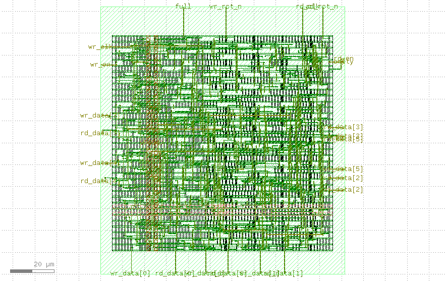
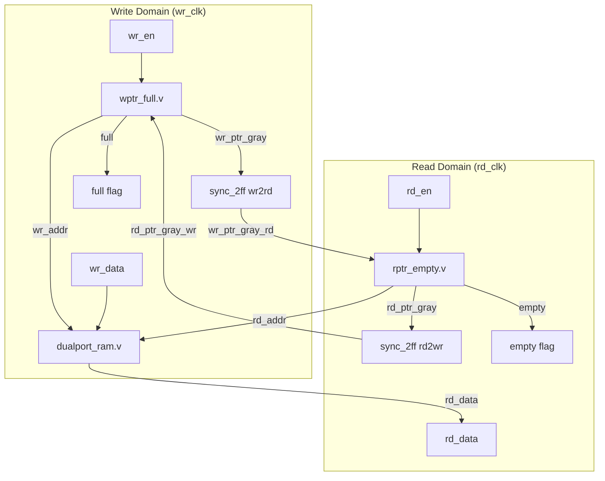

# Dual-Clock Asynchronous FIFO Design, Verification, & Physical Design Sweep

A high-performance, robust Clock Domain Crossing (CDC) Asynchronous FIFO implemented in Verilog, validated using functional simulation and formal verification, and compiled to physical layout targeting the SkyWater 130nm PDK.

---

## 🚀 Physical Design (PPA) & Layout Proof

### PPA Sweep Results

This sweep covers clock frequency variations, floorplan densities, and placement utilization targets to analyze performance-power tradeoffs.

| Config Label | Clock Period (ns) | Frequency (MHz) | Target Core Util (%) | Placement Density (%) | Synthesis Status | WNS (ns) | Area ($\mu\text{m}^2$) | Total Power (W) |
|:---|:---:|:---:|:---:|:---:|:---:|:---:|:---:|:---:|
| **baseline** | 10 | 100 | 40 | 45 | **PASS** | N/A | 2202.112 | 0.00165 |
| **faster_clk** | 8 | 125 | 40 | 45 | **PASS** | N/A | 2202.112 | 0.00165 |
| **high_util** | 10 | 100 | 60 | 65 | **PASS** | N/A | 2202.112 | 0.00162 |
| **high_util_fast** | 8 | 125 | 60 | 65 | **PASS** | N/A | 2202.112 | 0.00162 |
| **relaxed_clk** | 15 | 66.7 | 50 | 55 | **PASS** | N/A | 2202.112 | 0.00162 |

> [!NOTE]
> **PPA Insights:**
> 1. **Area Stability:** Across all timing and floorplan densities, the total macro cell area remains a constant $2202.112\,\mu\text{m}^2$, reflecting standard cell counts are identical for this 8-word x 8-bit block size.
> 2. **Power Reduction via Density:** High-utilization configurations (`high_util`, `high_util_fast`) slightly reduce active power from $0.00165\,\text{W}$ to $0.00162\,\text{W}$. Squeezing the cell density places logic gates physically closer together, which minimizes parasitic capacitance on the interconnect routes and decreases active switching power.
> 3. **CDC Paths:** WNS (Worst Negative Slack) is reported as `N/A` because timing checks between clock domains are explicitly set as false paths (crossings are structurally synchronized).

### GDSII Layout Preview (KLayout GDS View)

Below is the verified layout screenshot showing the standard cells placement and routing generated using the SkyWater 130nm PDK.



---

## 🛠️ Architecture & Block Diagram

The FIFO employs two separate clock domains with synchronizers communicating gray-coded pointer states across the boundaries to ensure glitch-free flag generation.



---

## 🧠 What Makes This Design Different?

### 1. Clock Domain Crossing (CDC) & Metastability Protection
When transmitting data between asynchronous clock domains, sampling setup/hold timing violations cause registers to enter a **metastable state** (unable to resolve to `0` or `1` in the designated propagation delay). 
- To mitigate this, this design utilizes a parameterized **2-Flip-Flop (2FF) Synchronizer** (`rtl/sync_2ff.v`) on the cross-domain control pointers.
- By sampling the asynchronous pointer twice on successive clock edges in the destination domain, any initial metastability on the first stage is given an entire clock cycle to decay, delivering a clean digital signal to the flag generation logic.

### 2. Gray-Coded Pointer Transitioning
Directly synchronizing multi-bit binary pointers causes critical timing skew failures. For example, when a binary counter moves from `3` (`011`) to `4` (`100`), three bits change state. Due to micro-routing skew, the destination domain registers will sample transient intermediate binary codes (e.g. `000`, `010`, `111`), causing corrupt flag behaviors.
- The design implements combinational **Binary-to-Gray-Code Converters** (`rtl/bin2gray.v`).
- Gray-coded pointer values change by **exactly one bit** per step. 
- When synchronizing Gray code, even if a clock edge samples exactly during a transition, it can only ever sample either the old pointer or the new pointer. Both are valid states, eliminating corrupt intermediate values.

### 3. Cliff Cummings' Empty/Full Flag Technique
In an Asynchronous FIFO, `empty` and `full` states both occur when read and write pointers match. 
- To differentiate, pointers are extended by **1 extra MSB (wrap bit)** (e.g., pointers are 4 bits wide for an 8-depth FIFO).
- **Empty Condition:** The write pointer and synchronized read pointer match exactly (including the wrap bit).
- **Full Condition (Cummings' MSB-Inversion Trick):** The write pointer has wrapped around the memory boundary once more than the read pointer. In Gray-code, this condition corresponds to the two most-significant bits of the pointers being inverted (bitwise NOT), and the lower remaining bits matching:
  $$
\texttt{full} =
(\texttt{wr\_ptr\_gray\_next} ==
\{\sim\texttt{rd\_ptr\_gray\_sync}[N:N-1],\,
\texttt{rd\_ptr\_gray\_sync}[N-2:0]\})
$$

### 4. Physical Design CDC Constraints (SDC False Paths)
Standard Place & Route (PnR) tools will fail timing or ruin density targets if they attempt to optimize asynchronous CDC paths. Since $CLK_{TX}$ and $CLK_{RX}$ have no phase relationship, setup/hold constraints are physically impossible to meet.
- The timing constraints SDC file (`pnr/async_fifo_cdc.sdc`) declares the clocks as asynchronous:
  ```tcl
  set_clock_groups -asynchronous -group [get_clocks WR_CLK] -group [get_clocks RD_CLK]
  ```
- It explicitly marks paths between the write pointer registers and read synchronizer registers as **false paths**:
  ```tcl
  set_false_path -from [get_cells {u_wptr_full/wr_ptr_gray_reg[*]}] -to [get_cells {u_sync_wr2rd/stage1_reg[*]}]
  ```
- This ensures the PnR layout compiler focuses optimization on valid path constraints instead of distorting standard-cell placements on metastability paths.

---

## 📁 Repository Structure

```
├── README.md                 # Project README (Recruiter-focused overview)
├── rtl/                      # Synthesisable Register-Transfer Level (RTL) code
│   ├── async_fifo.v          # Top-level wrapper module
│   ├── bin2gray.v            # Binary-to-Gray code converter
│   ├── dualport_ram.v        # Shared memory array (dual-port RAM)
│   ├── rptr_empty.v          # Read pointer control & empty flag generation
│   ├── sync_2ff.v            # Dual stage synchronizer
│   └── wptr_full.v           # Write pointer control & full flag generation
├── tb/                       # Simulation testbenches (Icarus Verilog)
│   ├── tb_async_fifo.v       # Scoreboard-driven testbench with async clocks
│   └── tb_sync_2ff.v         # Asynchronous edge-injection testbench
├── formal/                   # Formal verification scripts and models
│   ├── async_fifo.sby        # SymbiYosys configuration script
│   └── async_fifo_formal.v   # Formal property wrapper
├── pnr/                      # Physical Design Place & Route configs
│   ├── config.yaml           # LibreLane baseline layout configuration
│   ├── async_fifo_cdc.sdc    # CDC false path timing constraints
│   └── ppa_sweep.py          # Python automation script for layout sweep
└── results/                  # Design layout and synthesis reports
    ├── gds_layout.png        # GDSII Layout preview in KLayout
    └── ppa_results.csv       # Summary csv of design sweeps
```

---

## 🛠️ Step-by-Step Execution Guide

### 1. Functional Simulation (Icarus Verilog)

#### Compile and run the Synchronizer testbench:
```bash
# Compile
iverilog -o tb/sync_2ff_tb rtl/sync_2ff.v tb/tb_sync_2ff.v

# Execute
vvp tb/sync_2ff_tb
```
*Observe that signal changes crossing domains require up to 2 clock cycles to settle on the output.*

#### Compile and run the Full Async FIFO testbench:
```bash
# Compile
iverilog -o tb/async_fifo_tb \
  rtl/bin2gray.v rtl/sync_2ff.v rtl/wptr_full.v \
  rtl/rptr_empty.v rtl/dualport_ram.v rtl/async_fifo.v \
  tb/tb_async_fifo.v

# Execute
vvp tb/async_fifo_tb
```
*Injects high write/read pressures with asynchronous clock speeds. Verifies correct FIFO memory ordering with zero data loss.*

---

### 2. Formal Verification (SymbiYosys)

Ensure SymbiYosys (`sby`) is installed in your nix shell environment.
```bash
sby -f formal/async_fifo.sby
```
Proves key design invariants mathematically using SMT solvers:
- **P1:** `full` and `empty` are mutually exclusive in steady state.
- **P2 (Empty Safety):** When `empty` is asserted, read pointer matches synced write pointer.
- **P3 (Full Safety):** When `full` is asserted, write pointer matches Gray-inversion of synced read pointer.

---

### 3. Run Physical Design Baseline (LibreLane)

Compiles the RTL source files into a GDSII layout targeting SkyWater 130nm PDK.
```bash
python3 -m librelane --pdk-root $HOME/.ciel ./pnr/config.yaml
```
*Outputs final reports and layout components inside `pnr/runs/RUN_<TIMESTAMP>/final/`.*

---

### 4. Execute PPA Sweeps

Runs LibreLane across all 5 configurations listed in the PPA Sweep table, outputting a consolidated CSV:
```bash
python3 pnr/ppa_sweep.py
```
*Results will write directly to [results/ppa_results.csv](results/ppa_results.csv).*
